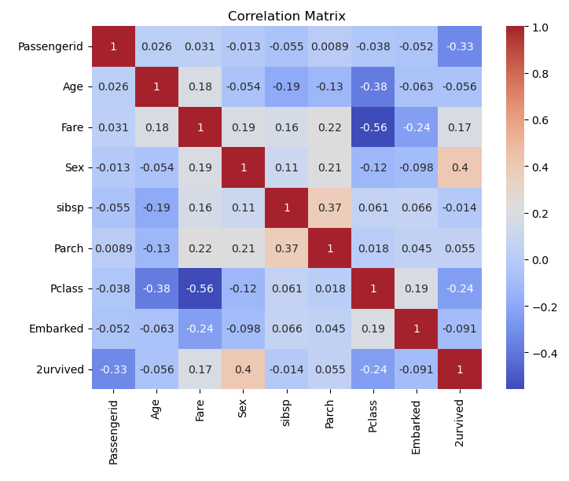
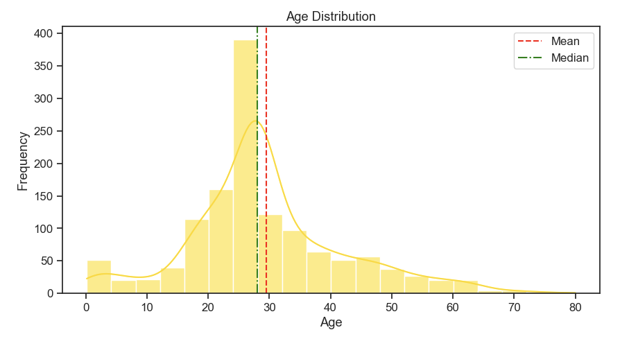
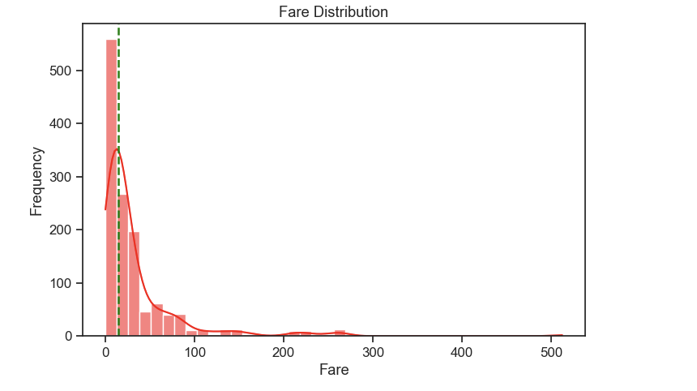
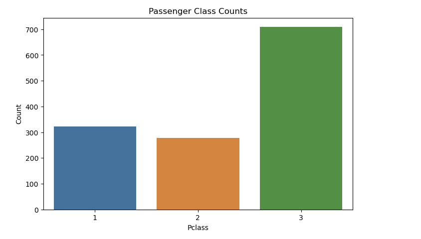
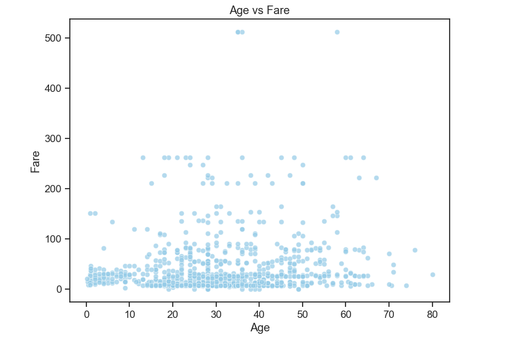
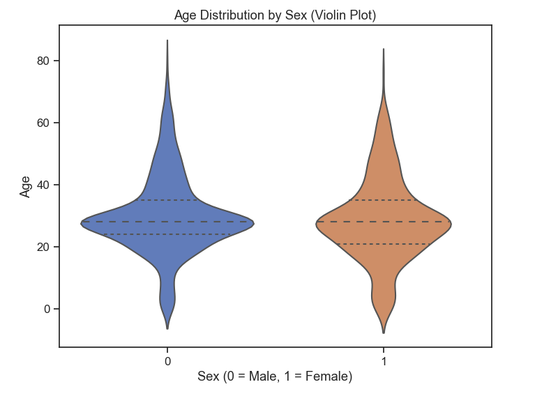

# 🚢 Titanic Survival Analysis & Prediction

**Survival Prediction and Statistical Analysis of Titanic Dataset Using Machine Learning and Hypothesis Testing**  
Exploratory Data Analysis (EDA), hypothesis testing, and logistic regression modeling on the classic [Titanic dataset](https://www.kaggle.com/datasets/heptapod/titanic/data).  
This project combines statistical insight and data storytelling with machine learning to predict passenger survival and explain underlying factors.

---

## 📊 Project Overview

The Titanic dataset is one of the most popular introductory datasets for data science and machine learning.  
In this project, we aim to:
- Perform **data cleaning and preprocessing** (handle missing values, outliers, normalization).
- Conduct **Exploratory Data Analysis (EDA)** to find patterns and correlations.
- Apply **Hypothesis Testing** and **A/B Testing** to statistically validate assumptions.
- Train a **Logistic Regression** model to predict passenger survival.
- Present results visually and analytically in an **IEEE-style research paper**.

## 🧮 Exploratory Data Analysis (EDA)

The following figures summarize the key exploratory data analysis performed on the Titanic dataset.

---

### 🔹 1. Correlation Matrix
Shows relationships between numerical variables.  
Strong correlations are observed between `Sex`, `Pclass`, and `Survived`.

---

### 🔹 2. Age Distribution
Distribution of passenger ages, showing a slight right-skew.  
The mean (~29.7) and median (~28.0) are close, indicating no severe outliers.

---

### 🔹 3. Fare Distribution
The fare values are highly right-skewed — most passengers paid less than $100,  
while a few outliers exceed $400, representing first-class passengers.

---

### 🔹 4. Passenger Class Counts
Shows the imbalance between passenger classes.  
About 55% of the passengers were in 3rd class, 20% in 2nd, and 25% in 1st.

---

### 🔹 5. Age vs Fare
No strong linear relationship is observed between passenger age and fare,  
suggesting that ticket price is more influenced by class than age.

---

### 🔹 6. Age Distribution by Gender
Violin plots show the distribution of age for male (0) and female (1) passengers.  
Females tend to be slightly younger on average, with lower variability.

---

